# Rails Charts


One more gem to build nice charts for your Ruby on Rails application.

With it you can build various types of charts Apache eCharts library (v. 5.3.2). This gem simplifies interface and adding few helpers to start adding charts in your app with just a few lines of code.

What you can build with it:

- line chart
- area chart
- bar chart
- donut chart
- pie chart
- radar chart
- calendar chart
- candlestick chart
- funnel chart
- gauge chart
- parallel chart
- sankey chart
- scatter chart
- stacked bar chart
- custom chart

In most cases with one line of code you can have a nice chart. The idea of this gem was inspired by [Charkick](https://github.com/ankane/chartkick) gem which is great and allows you to build charts very quickly. It works the best with cooperation of [groupdate](https://github.com/ankane/groupdate) gem. Unfortunatelly it's missing many needed types of charts or other customization options.

This implementation have more options and similar "interface" how to build charts (thanks to more Apache eCharts).

1) add gem in Gemfile, 
```ruby
gem "rails_charts"
```
2) add JS, for example in `application.js`

```js
//= require rails_charts/echarts.min.js
//= require rails_charts/theme/vintage.js
```

Note you can specify different themes.

3) add your first chart 
```ruby
<%= line_chart User.group(:age).count %>
```
4) customize charts if needed. See available options or [official documentation](https://echarts.apache.org/examples/en/index.html). 

## Installation

Add this line to your application's Gemfile:

```ruby
gem "rails_charts"
```

And then execute:
```bash
$ bundle
```

### Sprockets

1) add eCharts in main JS bundle, e.g. `app/assets/javascripts/application.js`

```javascript
//= require rails_charts/echarts.min.js
//= require rails_charts/theme/dark.js
```

2) start using :)

### Importmaps

1) change `config/importmap.rb`

```ruby
pin "rails_charts/echarts.min.js", to: "rails_charts/echarts.min.js", preload: true
pin "rails_charts/theme/dark.js", to: "rails_charts/theme/dark.js", preload: true
```

2) change manifest `app/assets/config/manifest.js`

```javascript
//= link rails_charts/echarts.min.js
//= link rails_charts/theme/dark.js
```

3) add eCharts in main JS 

```javascript
import "rails_charts/echarts.min.js"
```

4) start using :)

## Options

```ruby
<%= link_chart data, {
  width: '250px',
  height: '250px',
  theme: 'dark',
  class: 'chart-container-class',
  style: 'padding: 10px'
} %>
```

Available options:

```
width: specify width of the chart
height: specify height of the chart
theme: specify theme of the chart (available themes examples https://echarts.apache.org/en/download-theme.html)
class: specify container's CSS class
id: specify container's ID
style: add inline style
debug: for gem development useful if you want to pause somewhere in the code
vertical: applicable for some types of charts
code: to see output code what is generated to see the chart, useful for debugging
options: {...}, nested hash, specify additional eCharts options
```

Apache eCharts options - https://echarts.apache.org/en/option.html#title.

If you need to format tooltip (or other javascript function as an option) you can pass a JS function, but you need to wrap it like:

```ruby
  options: {
    tooltip: {
      valueFormatter: RailsCharts::Javascript.new("(value) => '$' + Math.round(value)")
    }
  }
```

## Charts

All examples available in https://github.com/railsjazz/rails_charts/tree/main/test/dummy/app/views/home. You can see more examples if you clone this repo and start a dummy app.

Every chart has a built in default configuration for tooltips, or other options (sample https://github.com/railsjazz/rails_charts/blob/main/lib/rails_charts/line_chart.rb#L64-L75). This is just to simplify usage of this gem. In the future the plan is to have it configured in initializer.

### Area Chart


```ruby
<%= area_chart User.distinct.pluck(:role).map{|e| {name: e, data: User.where(role: e).group_by_day(:created_at).count} } %>
```

### Line Chart

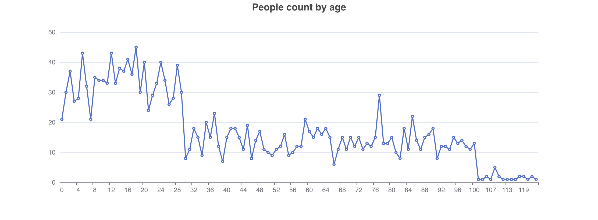

```ruby
<%= line_chart User.group(:age).count, class: 'box', 
  options: {
    title: {
      text: "People count by age",
      left: 'center'
    },
  }
%>
```

### Bar Chart

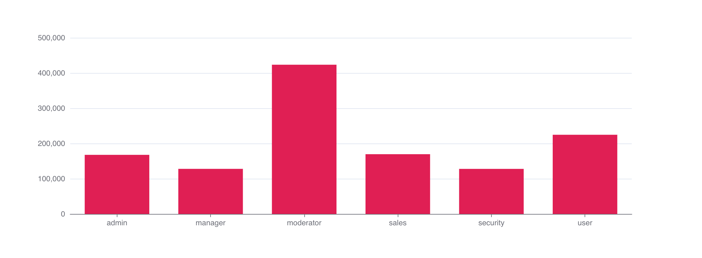

```ruby
<%= bar_chart User.group(:role).average(:age),
  class: 'box',
  theme: 'sakura',
  options: {
    series: { 
      barWidth: '50%'
    },
    tooltip: {
      valueFormatter: RailsCharts::Javascript.new("(value) => '$' + Math.round(value)")
    }
  }
%>
```

### Calendar Chart


```ruby
<%= calendar_chart Commit.for_calendar_chart,
  class: 'box',
  options: {
    visualMap: {
      show: true,
      min: 0,
      max: 40,
      orient: 'horizontal'
    },
    calendar: [{
      range: '2021',
    },]
  }
%>

```

### Candlestick Chart

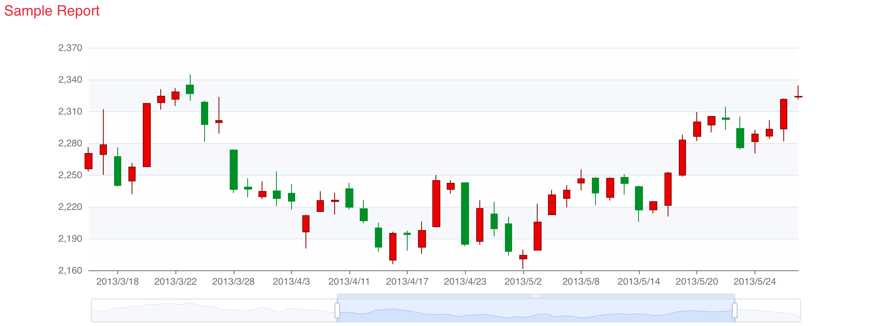

```ruby
<%= candlestick_chart({
    '2017-10-24' => [20, 34, 10, 38],
    '2017-10-25' => [40, 35, 30, 50],
    '2017-10-26' => [31, 38, 33, 44],
    '2017-10-27' => [38, 15, 5, 42]
  },
  class: 'box',
  theme: 'roma',
  options: {
    xAxis: {
      axisTick: {
        alignWithLabel: true
      }
    }
  })
%>
```

### Funnel Chart

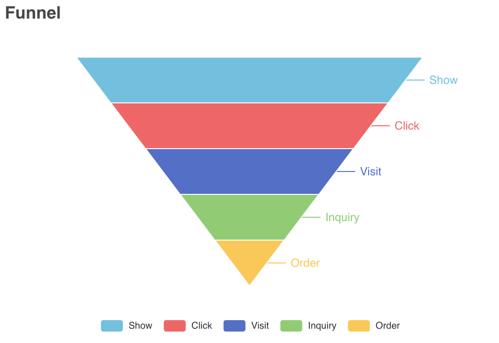

```ruby
<%= funnel_chart User.get_funnel_sample_data,
  class: 'box',
  height: '400px',
  options: {
    title: {
      text: 'Demo',
      left: 'center'
    }
  }
%>
```

### Gauge Chart

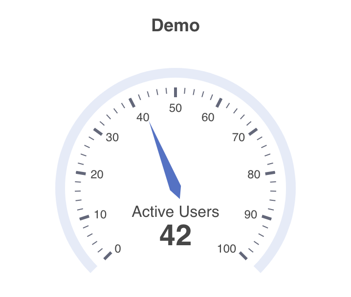

```ruby
<%= gauge_chart User.get_gauge_sample_data,
  class: 'box',
  height: '400px',
  options: {
    title: {
      text: 'Demo',
      left: 'center'
    }
  }
%>
```

### Parallel Chart

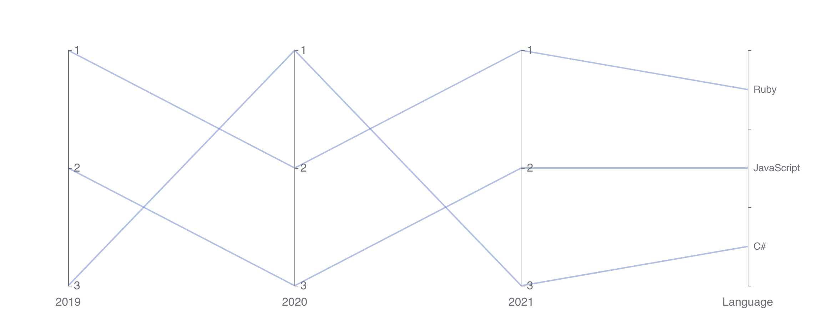

```ruby
<div class="box">
  <%= parallel_chart [
    [1, 2, 1, "Ruby"],
    [2, 3, 2, "JavaScript"],
    [3, 1, 3, "C#"]
  ], {
    options: {
      parallelAxis: [
        { dim: 0, name: '2019', inverse: true, minInterval: 1, min: 1, nameTextStyle: { fontSize: 16 }, axisLabel: { fontSize: 16 } },
        { dim: 1, name: '2020', inverse: true, minInterval: 1, min: 1, nameTextStyle: { fontSize: 16 }, axisLabel: { fontSize: 16 } },
        { dim: 2, name: '2021', inverse: true, minInterval: 1, min: 1, nameTextStyle: { fontSize: 16 }, axisLabel: { fontSize: 16 } },
        { dim: 3, type: "category", name: 'Language', data: ["Ruby", "JavaScript", "C#"], inverse: true, nameTextStyle: { fontSize: 16 }, axisLabel: { fontSize: 14 } },
      ]
    }
  }
  %>
</div>
```

### Donut Chart


```ruby
<%= donut_chart User.group(:role).count, 
  class: 'box',
  options: {
    legend: {
      bottom: '0'
    },
    emphasis: { 
      itemStyle: {
        shadowBlur: 10,
        shadowOffsetX: 0,
        shadowColor: 'rgba(0, 0, 0, 0.5)'
      } 
    }
  }
%>
```

### Pie Chart

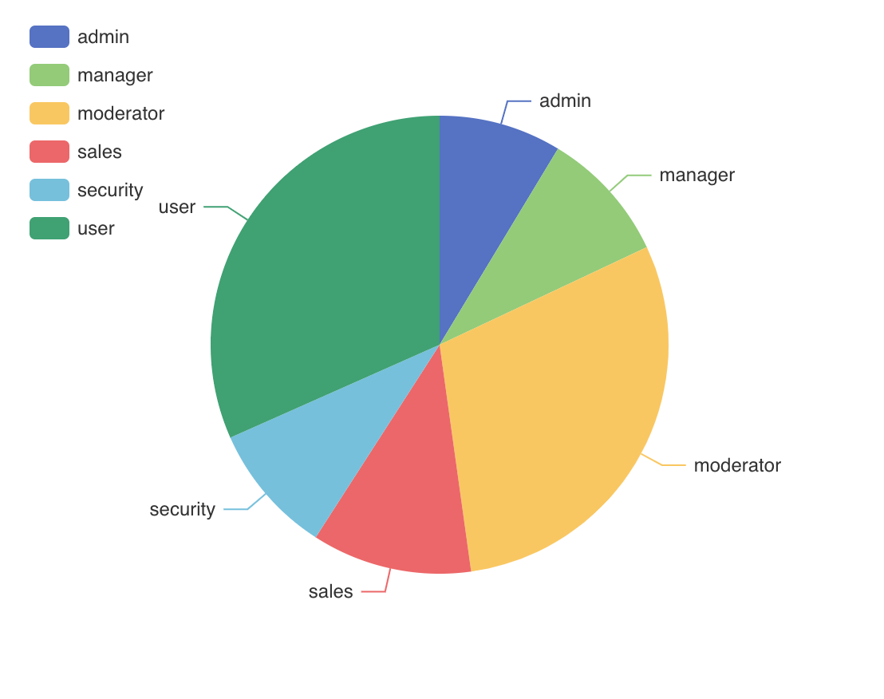

```ruby
<%= pie_chart User.group(:role).count, 
  class: 'box',
  options: {
    legend: { orient: 'vertical', left: 'left' }
  }
%>
```

### Radar Chart

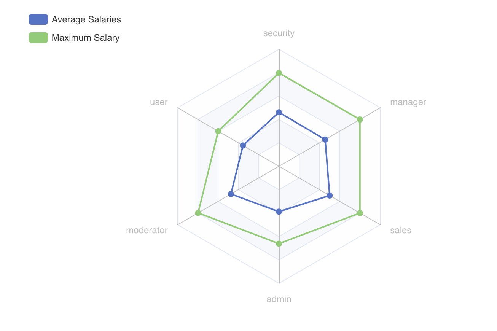

```ruby
<%= radar_chart User.get_data_for_radar_chart,
  class: 'box',
  options: {
    legend: {
      data: ['Average Salaries', 'Maximum Salary'],
      orient: 'vertical',
      left: '20%'
    }
  }
%>
```

### Sankey Chart

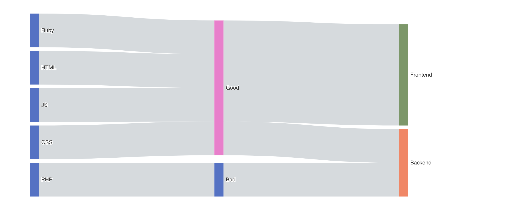

```ruby
<%= sankey_chart({
    data: [
      {name: 'Ruby'}, {name: 'HTML'}, {name: 'JS'}, {name: 'Good'}, {name: 'Bad'}, {name: 'CSS'}, {name: 'PHP'}, {name: 'Frontend'}, {name: 'Backend'}
    ],
    links: [
      {
        source: 'Ruby',
        target: 'Good',
        value: 1
      },
      {
        source: 'HTML',
        target: 'Good',
        value: 1
      },  
      {
        source: 'JS',
        target: 'Good',
        value: 1
      },  
      {
        source: 'CSS',
        target: 'Good',
        value: 1
      },
      {
        source: 'PHP',
        target: 'Bad',
        value: 1
      },
      {
        source: 'Good',
        target: 'Backend',
        value: 1
      },         
      {
        source: 'Good',
        target: 'Frontend',
        value: 3
      },
      {
        source: 'Bad',
        target: 'Backend',
        value: 1
      },             
    ]
  }, {
    options: {

    }
  })
  %>
```

### Scatter Chart

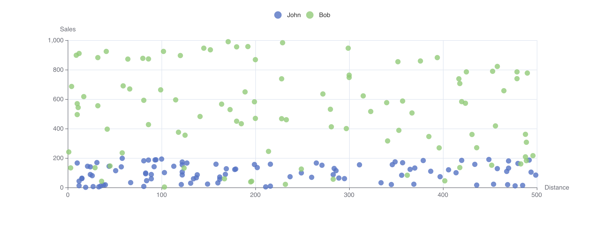

```ruby
<%= scatter_chart [
    { name: 'John', data: User.random_scatter_chart(500, 200) },
    { name: 'Bob', data: User.random_scatter_chart(500, 1000) },
  ],
  {
    class: 'box',
    options: {
      xAxis: {
        name: 'Distance'
      },
      yAxis: {
        name: 'Sales'
      },          
      legend: {
        data: [
          {name: 'John'},
          {name: 'Bob'},
        ]
      },
    },
  }
%>
```

### Stacked bar Chart

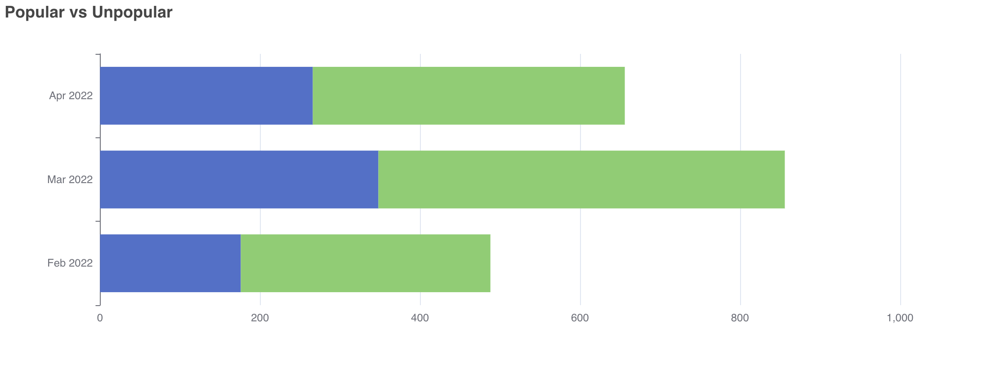

```ruby
<%= stacked_bar_chart [
    { name: 'high priority', data: Account.high_priority.group_by_month(:created_at, format: "%b %Y").count },
    { name: 'low priority', data: Account.low_priority.group_by_month(:created_at, format: "%b %Y").count }
  ],
  {
    options: {
      title: {
        text: "Popular vs Unpopular"
      },
    },
    class: 'box',
    vertical: true
  }
%>
```

### Custom Chart

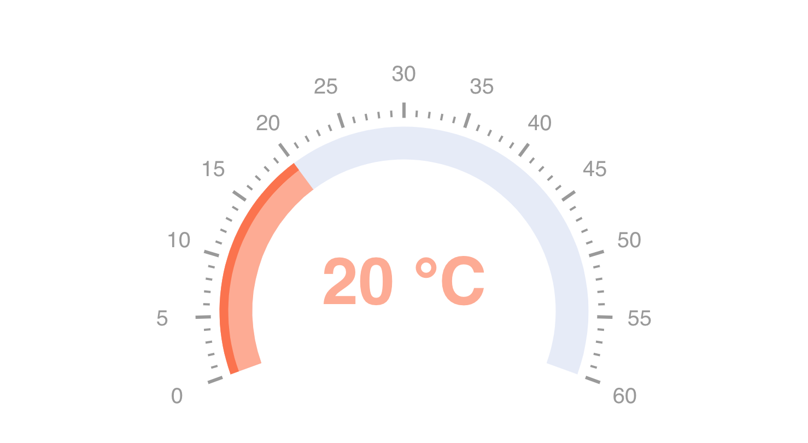

```ruby
<%= custom_chart {...raw JS options ...} %>
```

## Contributing

You are welcome to contributes. Some open tasks:

- importmaps support?
- webpacker support
- add more specs
- add more examples to the dummy app
- customization, options overides, default values?
- every "5sec" refresh
- remote data
- how to access chart from JS
- better documentation how to specify theme, locale, etc
- more examples with data structure
- add github actions
- add info about initializer and it's configuration
- specify info about default configs per chart
- add support for CSP similar to https://github.com/ankane/chartkick/blob/master/lib/chartkick/helper.rb#L55
- example of how to build multiple-chart charts

### Development and testing

`test/dummy/bin/rails s` - to start dummy app.

`rspec` - to run specs.

## License

The gem is available as open source under the terms of the [MIT License](https://opensource.org/licenses/MIT).

Gem is using https://echarts.apache.org/ to build charts.
